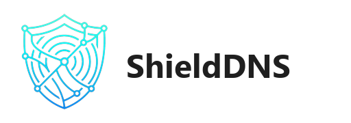

# ShieldDNS

ShieldDNS 允许您安全地接受来自移动设备的 DNS-over-TLS (DoT) 连接，并将它们转发到您本地的 AdGuard Home 或其他 DNS 服务器。这即使在您位于本地网络（如果您的设备强制执行 Private DNS）或如果您安全地公开此端口时，也能保护您的 DNS 查询。

## 配置

**注意**：您必须为正在使用的域名拥有有效的 SSL 证书。如果您使用标准的 HA SSL 设置，您的证书可能位于 `/ssl/`。

### 选项：`upstream_dns`（必需）

上游 DNS 服务器的 IP 地址。这通常是您的 AdGuard Home IP，或者如果您只想将 DoT 网关连接到互联网，则为 `1.1.1.1`。

### 选项：`certfile`（必需）

在 `/ssl/` 目录中您的证书文件的名称。
示例：`fullchain.pem`

### 选项：`keyfile`（必需）

在 `/ssl/` 目录中您的私钥文件的名称。
示例：`privkey.pem`

### 选项：`cloudflare_tunnel_token`（可选）

如果您想通过 Cloudflare Tunnel（无需端口转发）公开您的 DNS 服务器，请在此处提供您的 Tunnel Token。

1. 在 Cloudflare Zero Trust 控制台中创建一个隧道。
2. 选择 "Docker" 作为环境。
3. 复制令牌（安装命令中 `--token` 后面的长字符串）。
4. 将其粘贴在此处。

### 选项：`log_level`（可选）

设置日志的详细程度。

- `error`：仅显示关键错误。
- `info`：标准日志记录（包括 DNS 查询）。
- `debug`：详细日志记录（用于故障排除）。

### 选项：`dot_port`（Android 原生 Private DNS 必需）

监听 DNS-over-TLS 的端口。默认：`8853`。

- **为什么是 8853？**：以避免如果 AdGuard Home 已经使用端口 853 时崩溃。
- **如何在 Android 上使用**：Android 要求端口 853。
  - **路由器配置**：创建一个端口转发规则：**WAN 端口 853** -> **LAN 端口 8853**（Home Assistant 的 IP）。
  - 这样，外部世界看到的是 853（标准），但您的 Host 使用 8853（无冲突）。

### 选项：`doh_port`（Cloudflare Tunnel 必需）

监听 DNS-over-HTTPS 的端口。默认：`3443`。
_注意：默认为 3443 以避免与 443 上的 Home Assistant UI 冲突。隧道应指向此处。_

### 选项：`doh_alt_port_1` & `doh_alt_port_2`（可选）

可选的 DoH/HTTPS 额外端口（例如 784、2443）。默认禁用。

### 选项：`enable_info_page`（可选）

在 DoH 端口（根 URL `/`）上启用轻量级的“状态页面”。

- **true**：在浏览器中访问 `https://dns.example.com` 将显示状态页面（“ShieldDNS 在线”）。
- **false**（默认）：访问根 URL 通常返回 404 或空响应，以提高隐蔽性。

## 📱 Android & Cloudflare Tunnel：请阅读此部分

关于 Android “Private DNS” 存在一个常见的误解。

- **Android Private DNS** = **DoT**（端口 853）。
- **Cloudflare Tunnel** = **DoH**（端口 443/HTTPS）。

**它们不是原生的兼容。**

如果您使用 Cloudflare Tunnel：

1. 您 **不能** 使用 Android 设置中的“Private DNS”设置。它将保持“连接中…”或“无法访问”。
2. 您 **必须** 使用像 **[Intra](https://play.google.com/store/apps/details?id=app.intra)** 这样的应用。
    - 在 Intra 中：设置 > DNS over HTTPS URL > `https://your-domain.com/dns-query`。

如果您想使用原生的“Private DNS”（DoT）：

1. **要求**：您需要一个第二个 DNS 记录（例如 `dot.example.com`）。
2. **DNS 配置**：此记录必须是 **仅 DNS**（灰色云）并指向您的家庭 IP。
3. **路由器配置**：端口转发 **WAN 853** -> **LAN 8853**（HA IP）。
4. **Android 配置**：在设置中输入 `dot.example.com`。

**总结**：
| 客户端 | 主机名 | 入口 | 协议 |
| :--- | :--- | :--- | :--- |
| **Android（应用）** | `doh.example.com` | 隧道 | DoH (HTTPS) |
| **Android（原生）**| `dot.example.com` | 端口转发 | DoT (TCP/853)|
| **iOS / 浏览器** | `doh.example.com` | 隧道 | DoH (HTTPS) |

## 网络

此插件以 **主机网络** 模式运行以保留 DNS 查询的“源 IP”。
这意味着：

1. **源 IP**：AdGuard Home 将看到客户端的真实 IP（例如您的手机）。
2. **端口**：上面配置的端口直接在您的 Host 设备上打开。
3. **冲突**：确保这些端口没有被其他服务使用（例如 AdGuard Home 加密或 Nginx Proxy Manager）。

## 集成

### Cloudflare Tunnel（官方插件）支持

您可以使用官方的 **Cloudflare Tunnel** Home Assistant 插件（或 cloudflared docker 容器）将此插件公开到互联网而无需打开端口。

**设置**：

1. 在 Cloudflare 控制台中创建一个公共主机名（例如 `dns.example.com`）。
2. 将服务指向 `HTTPS://localhost:3443`（或您配置的任何 `doh_port`）。
3. 在 **TLS 验证** 下禁用验证（无 TLS 验证）或提供 CA。

### AdGuard Home 集成

要将此插件用作 **AdGuard Home** 的安全前端：

1. 在 Home Assistant 中安装 AdGuard Home 插件。
2. 记下您的 Home Assistant 的 IP 地址/主机名。
3. 在 ShieldDNS 配置中，将 `upstream_dns` 设置为该 IP。
4. ShieldDNS 现在将接受加密请求并将其本地转发到 AdGuard Home。
5. **端口冲突**：由于 ShieldDNS 以主机网络运行，它不能与 AdGuard Home 共享端口，如果两者尝试绑定所有接口上的相同端口。
   - 如果 AdGuard 使用 443/853，请更改 ShieldDNS 配置中的端口（`dot_port`、`doh_port`）或禁用 AdGuard 中的加密。

## 支持的协议

| 参数  | 协议 | 默认 |
| ---------- | -------- | ------- |
| `dot_port` | DoT      | 853     |
| `doh_port` | DoH      | 3443    |

## 使用方法

1. 配置上述选项。
2. 启动插件。
3. 在您的 Android 设备上：
   - **方法 A（应用 - 推荐）**：安装 **Intra**，将 URL 设置为 `https://<your-domain>/dns-query`。
   - **方法 B（原生 - 仅端口转发）**：前往 **设置 > Private DNS** 并输入 `<your-domain>`。
4. 保存。您的设备现在将发送加密的 DNS 查询！

## 🛡️ 安全最佳实践

由于您通过隧道或端口转发公开了 DNS 服务器，因此您应该保护它以防止滥用（DNS 放大、扫描、DDoS）。

### 1. Cloudflare Tunnel（强烈推荐）

使用 Cloudflare Tunnel 隐藏您的源 IP 并允许您使用 **Cloudflare Zero Trust** 功能。

- **WAF / 自定义规则**：
  - **阻止国家**：阻止所有国家，除了您自己的国家。
  - **阻止机器人**：启用“机器人战斗模式”或阻止已知的机器人 User-Agent。
- **速率限制**：为您的主机名设置速率限制规则（例如每 IP 最大 50 个请求 / 10 秒）以防止洪水。
- **Zero Trust 身份验证**：如果可行，将 DNS 端点放在 Cloudflare Access 后面（注意：这会破坏标准的 DoH 客户端，除非它们支持身份验证标头）。

### 2. 一般防火墙

如果没有 Cloudflare（直接暴露）：

- **白名单 IP**：仅允许您自己的移动 IP 范围或特定网络（如果可能）。
- **Fail2Ban**：监控日志并禁止滥用 IP（需要将日志挂载到主机）。
- **限制速率**：使用 `iptables` 或 UFW 限制端口 853/443 的连接速率。

## 故障排除

检查插件的日志。如果证书无效或路径错误，CoreDNS 将无法启动。
---
**⚠️ This resource is intended to help Chinese Home Assistant users more easily install excellent add-ons. If you are not a Chinese user, please read repository readme first**
**⚠️ 这个资源用来帮助中国Home Assistant用户更容易地安装优秀的插件。如果您不是中国用户，请先阅读仓库的README，以下为收集者（汉化，加速）信息，非原作者信息**
---

## 📱 关注我

扫描下面二维码，关注我。有需要可以随时给我留言：

 📲

## ☕ 赞助支持

如果您觉得我花费大量时间维护这个库对您有帮助，欢迎请我喝杯奶茶，您的支持将是我持续改进的动力！

  
  

 💖

感谢您的支持与鼓励！
