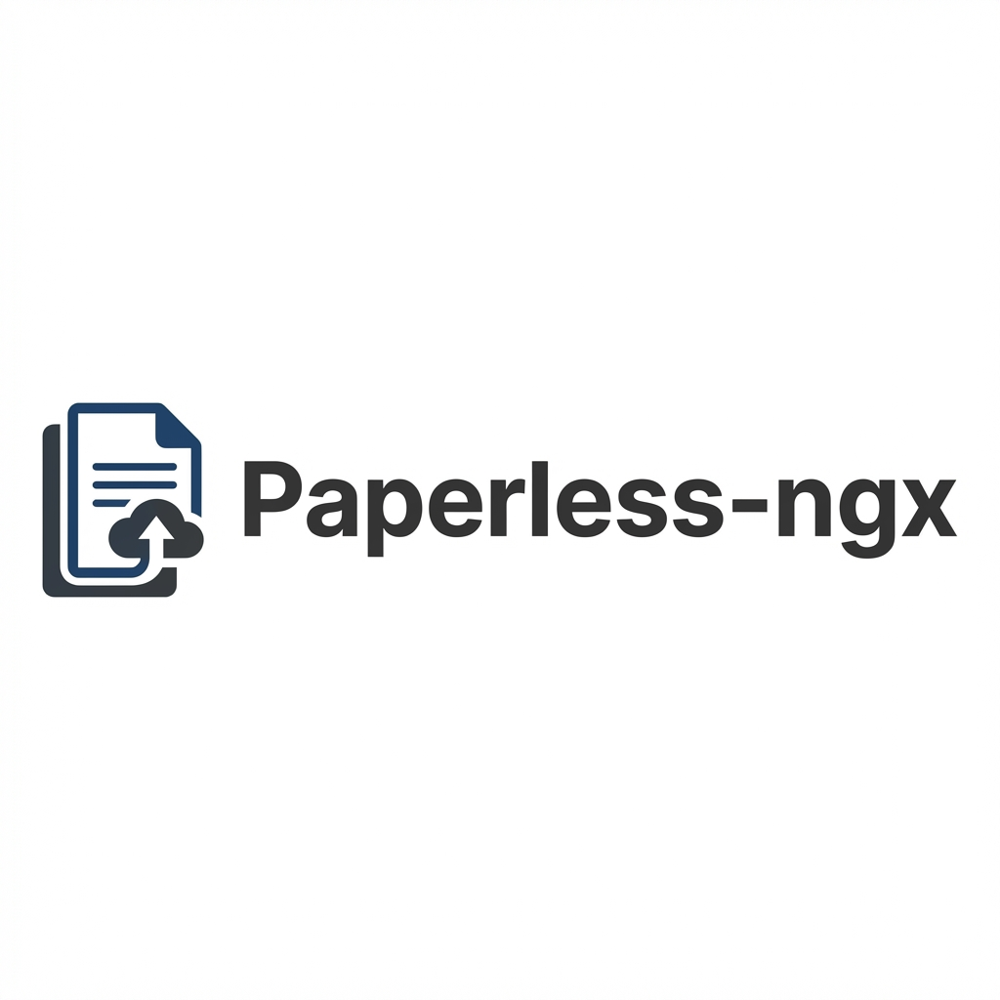

# Paperless-ngx



[](https://my.home-assistant.io/redirect/supervisor_addon/?addon=c1e285b7_paperless-ngx)
[](https://www.home-assistant.io/addons/)
[](https://github.com/FaserF/hassio-addons/pkgs/container/hassio-addons-paperless-ngx)


> 社区支持的 Paperless-ngx Home Assistant 插件

---

> [!CAUTION]
> **实验性/测试版状态**
>
> 此插件仍在开发中，主要开发用于个人使用。
> 目前尚未经过广泛测试，但预计基本功能可以正常工作。

---

## 📖 关于

扫描、索引和存档您所有的实体文档。

[Paperless-ngx][paperless-ngx] 是一个社区支持的开放式文档管理系统，它将您的实体文档转换为可搜索的在线存档，以便您减少纸质文件。

此插件将 Paperless-ngx 带到 Home Assistant OS，与 Ingress 完全集成，并在轻量级的 Alpine Linux 基础上运行。

## 功能

- **Ingress 支持**：直接从 Home Assistant 仪表板访问 Paperless。
- **Renovate 监控**：自动保持更新。
- **OCR 支持**：内置德语和英语的 OCR（可配置）。
- **架构**：支持 aarch64、amd64 和 armv7。

## 安装

1. 将此仓库添加到您的 Home Assistant 插件商店。
2. 安装 **Paperless-ngx** 插件。
3. 在 `配置` 选项卡中配置您的偏好设置（时区、OCR 语言、管理员用户）。
4. 启动插件。

---

## ⚙️ 配置

通过 Home Assistant 插件页面的 **配置** 选项卡配置插件。

### 选项

```yaml
admin_user: admin
filename_format: '{created_year}/{correspondent}/{title}'
log_level: info
ocr_language: deu
time_zone: Europe/Berlin
url: ''
```

---

## 👨‍💻 致谢 & 许可证

本项目是开源的，并在 MIT 许可证下提供。
由 **FaserF** 维护。

---
**⚠️ This resource is intended to help Chinese Home Assistant users more easily install excellent add-ons. If you are not a Chinese user, please read repository readme first**
**⚠️ 这个资源用来帮助中国Home Assistant用户更容易地安装优秀的插件。如果您不是中国用户，请先阅读仓库的README，以下为收集者（汉化，加速）信息，非原作者信息**
---

## 📱 关注我

扫描下面二维码，关注我。有需要可以随时给我留言：

 📲

## ☕ 赞助支持

如果您觉得我花费大量时间维护这个库对您有帮助，欢迎请我喝杯奶茶，您的支持将是我持续改进的动力！

<div style="display: flex; justify-content: space-between;">
  
  
</div> 💖

感谢您的支持与鼓励！
