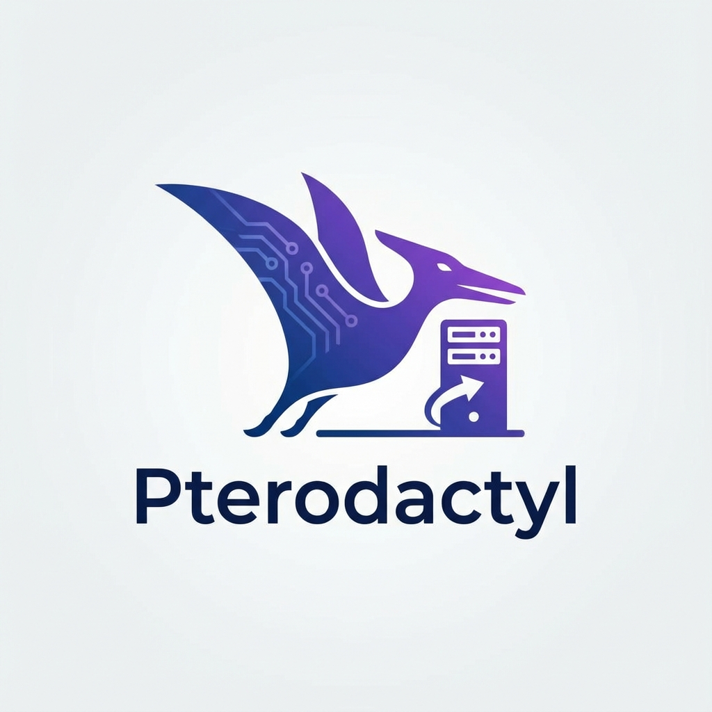

# pterodactyl Panel Gameserver - BETA



[](https://my.home-assistant.io/redirect/supervisor_addon/?addon=c1e285b7_pterodactyl-panel)
[](https://www.home-assistant.io/addons/)
[](https://github.com/FaserF/hassio-addons/releases)


> 开源游戏服务器 - 目前尚未完全可用

---

> [!警告]
> **实验性 / Beta 状态**
>
> 此附加组件仍在开发中，或主要开发用于个人使用。
> 它尚未经过广泛测试，但预计基本功能可以正常工作。

---

## 📖 关于

适用于 Homeassistant OS 的 pterodactyl Panel Gameserver


> [!警告]
> 目前仅部分可用。目前可以将其视为 Beta 版且不稳定。
> 如果您的游戏服务器丢失等，不要怪我。
>
> 对我来说，我目前无法登录。似乎与 redis 有关，但我不知道具体是什么。

Pterodactyl® 是一个免费、开源的游戏服务器管理面板，使用 PHP、React 和 Go 构建。
考虑到安全性，Pterodactyl 在隔离的 Docker 容器中运行所有游戏服务器，同时为最终用户提供一个美观且直观的 UI。
停止妥协。让游戏服务器成为您平台的一流成员。

## 安装

此附加组件的安装非常简单，与安装任何其他自定义 Home Assistant 附加组件没有区别。
只需点击上面的链接或将我的仓库添加到 hassio 附加组件仓库：
<https://github.com/FaserF/hassio-addons>

---

## ⚙️ 配置

通过 Home Assistant 附加组件页面中的 **配置** 选项卡配置附加组件。

### 选项

```yaml
certfile: fullchain.pem
keyfile: privkey.pem
log_level: info
password: ''
ssl: true
```

---

## 👨‍💻 致谢 & 许可证

此项目是开源的，并根据 MIT 许可证提供。
由 **FaserF** 维护。
---
**⚠️ This resource is intended to help Chinese Home Assistant users more easily install excellent add-ons. If you are not a Chinese user, please read repository readme first**
**⚠️ 这个资源用来帮助中国Home Assistant用户更容易地安装优秀的插件。如果您不是中国用户，请先阅读仓库的README，以下为收集者（汉化，加速）信息，非原作者信息**
---

## 📱 关注我

扫描下面二维码，关注我。有需要可以随时给我留言：

 📲

## ☕ 赞助支持

如果您觉得我花费大量时间维护这个库对您有帮助，欢迎请我喝杯奶茶，您的支持将是我持续改进的动力！

<div style="display: flex; justify-content: space-between;">
  
  
</div> 💖

感谢您的支持与鼓励！
