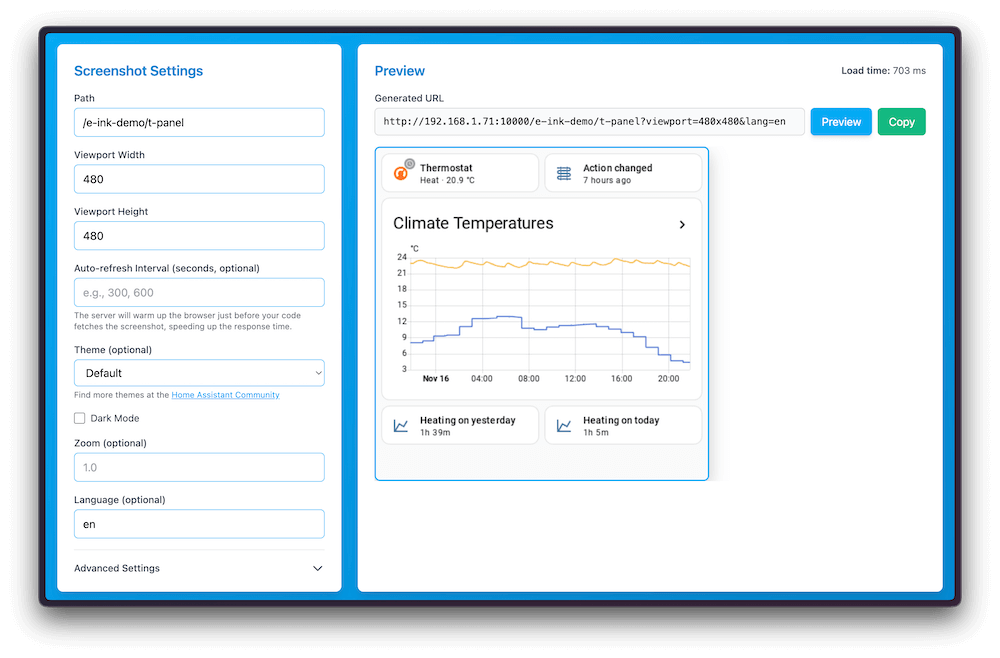
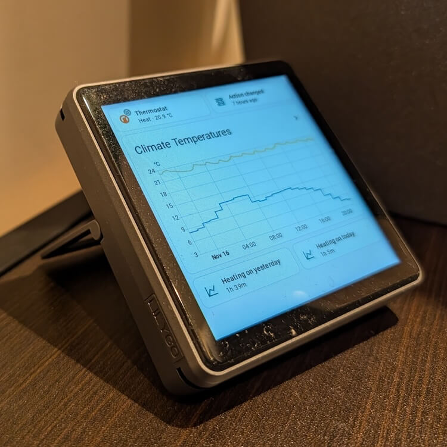

# 使用Puppeteer截取Home Assistant的屏幕截图

轻松创建Home Assistant仪表板的屏幕截图。允许您将它们放在电子墨水屏幕或其他可以显示图像的屏幕上。

[](https://my.home-assistant.io/redirect/supervisor_addon/?addon=0f1cc410_puppet&repository_url=https%3A%2F%2Fgithub.com%2Fballoob%2Fhome-assistant-addons)





您需要创建一个长时间有效的访问令牌并将其作为插件选项添加。

启用看门狗选项，以便在浏览器启动失败时重新启动插件（这种情况有时会发生，仍在调查中）。

_这是一个原型，没有安全性。任何人都可以访问服务器并对任何Home Assistant页面进行屏幕截图。_

[](./example/)

## 配置

- access_token: 用于对Home Assistant进行身份验证的长时间有效访问令牌。

## 高级配置

- home_assistant_url: 当插件浏览器在拍摄屏幕截图时打开的Home Assistant实例的基本URL。默认值为`http://homeassistant:8123`，这是插件可以访问Home Assistant的内部URL。如果您的实例在Home Assistant中配置了SSL证书，并且需要通过不同的主机名或端口访问（例如，http://my-ha.local:8123 或 https://example.duckdns.org），则可以覆盖它。
- keep_browser_open: 如果为true，则保持Chromium浏览器在请求之间保持活动状态。

## Web UI

该插件现在包括一个基于Web的用户界面，以帮助您轻松配置和预览屏幕截图。您可以通过以下方式访问它：

1. 从Home Assistant Supervisor界面打开插件的Web UI
2. 或者直接导航到`http://homeassistant.local:10000/`

Web UI提供：
- 交互式表单来配置屏幕截图参数（路径、视口大小、格式、主题等）
- 屏幕截图的实时预览
- 自动生成的URL，您可以复制并在自动化或外部应用程序中使用

这对于在自动化中使用URL之前测试不同设置并找到完美配置特别有用。

## 使用方法

启动插件将在端口10000上启动一个新服务器。您请求的任何路径都将返回该页面的屏幕截图。您需要指定您想要的视口大小。

例如，要获取1000px x 1000px的默认仪表板屏幕截图，请获取：

```
http://homeassistant.local:10000/lovelace/0?viewport=1000x1000
```

### 电子墨水屏幕

为了减少电子墨水屏幕的调色板，您可以添加`eink`参数。该值表示要使用的颜色数（包括黑色）。例如，对于2色电子墨水屏幕：

```
http://homeassistant.local:10000/lovelace/0?viewport=1000x1000&eink=2
```

如果您使用`eink=2`，您还可以通过添加`invert`参数来反转颜色：

```
http://homeassistant.local:10000/lovelace/0?viewport=1000x1000&eink=2&invert
```

建议使用类似[Graphite](https://github.com/TilmanGriesel/graphite?tab=readme-ov-file#e-ink-themes)的电子墨水主题以优化可读性。

### 设置主题

您可以通过添加`theme`查询参数来设置Home Assistant界面的屏幕截图主题。该值应该是Home Assistant支持的主题名称（例如，`Graphite E-ink Light`）。

```
http://homeassistant.local:10000/lovelace/0?viewport=1000x1000&theme=Graphite%20E-ink%20Light
```

### 完成加载检测

默认情况下，在冷启动时，服务器将在加载被认为完成后的2.5秒内等待，以给那些没有被加载旋转器跟踪的东西加载（即图标、图片）。当浏览器处于活动状态时，它等待750毫秒。您可以通过添加`wait`查询参数来控制等待时间。例如，要等待10秒：

```
http://homeassistant.local:10000/lovelace/0?viewport=1000x1000&wait=10000
```

您可以使用`zoom`查询参数来控制页面的缩放级别。默认缩放级别为1。例如，要放大1.3倍：

```
http://homeassistant.local:10000/lovelace/0?viewport=1000x1000&zoom=1.3
```

### 输出格式

默认输出格式为PNG。您可以通过添加`format=jpeg`、`format=webp`、`format=bmp`查询参数来请求JPEG、WebP或BMP图像：

```
http://homeassistant.local:10000/lovelace/0?viewport=1000x1000&format=jpeg
```

```
http://homeassistant.local:10000/lovelace/0?viewport=1000x1000&format=webp
```

```
http://homeassistant.local:10000/lovelace/0?viewport=1000x1000&format=bmp
```

**注意：** 如果指定了`eink`参数，输出格式将限制为BMP和PNG。

### 旋转屏幕截图

您可以通过添加`rotate`查询参数来旋转屏幕截图。有效值为90、180和270。

```
http://homeassistant.local:10000/lovelace/0?viewport=1000x1000&rotate=90
```

### 设置语言

您可以通过添加`lang`查询参数来设置屏幕截图的Home Assistant界面语言。该值应该是Home Assistant支持的语言代码（例如，`en`、`nl`、`de`、`ko`、`ja`、`zh-Hans`、`zh-Hant`）。

```
http://homeassistant.local:10000/lovelace/0?viewport=1000x1000&lang=nl
```

### 设置暗黑模式

您可以通过添加`dark`查询参数来启用屏幕截图的暗黑模式。此参数不需要值。

```
http://homeassistant.local:10000/lovelace/0?viewport=1000x1000&dark
```

### 预加载请求

为了提高后续请求的性能，您可以使用`next`参数提前安排浏览器导航到目标页面。提供您预期下一个屏幕截图请求发生的秒数。插件将尝试在指定时间戳前10秒导航浏览器到指定路径。

```
# 示例说明浏览器将提前预热，以便在300秒后准备进行屏幕截图
# http://homeassistant.local:10000/lovelace/0?next=300
```

提供`next`参数不会影响当前请求。它将仅用于下一个请求。

## Proxmox

如果您在Proxmox虚拟机下运行Home Assistant OS，请确保您的虚拟机的主机类型设置为`host`。

## 速度（或缺乏速度）

此插件很慢。在Home Assistant Green上，冷启动时大约需要10秒。浏览器最多保持30秒的活动状态。

如果请求相同的页面，屏幕截图将尽快返回（在HA Green上为0.6秒）。如果请求不同的页面，它将需要大约1.5秒，因为它需要导航。
**⚠️ This resource is intended to help Chinese Home Assistant users more easily install excellent add-ons. If you are not a Chinese user, please read repository readme first**


## 📱 关注我

扫描下面二维码，关注我。有需要可以随时给我留言：

 📲

## ☕ 赞助支持

如果您觉得我花费大量时间维护这个库对您有帮助，欢迎请我喝杯奶茶，您的支持将是我持续改进的动力！

<div style="display: flex; justify-content: space-between;">
  
  
</div> 💖

感谢您的支持与鼓励！
